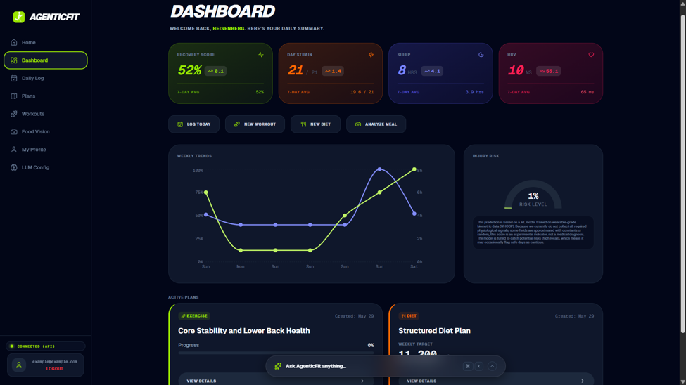
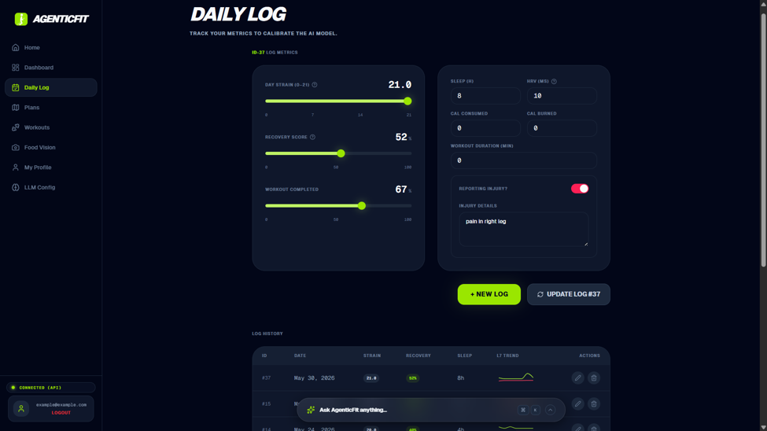
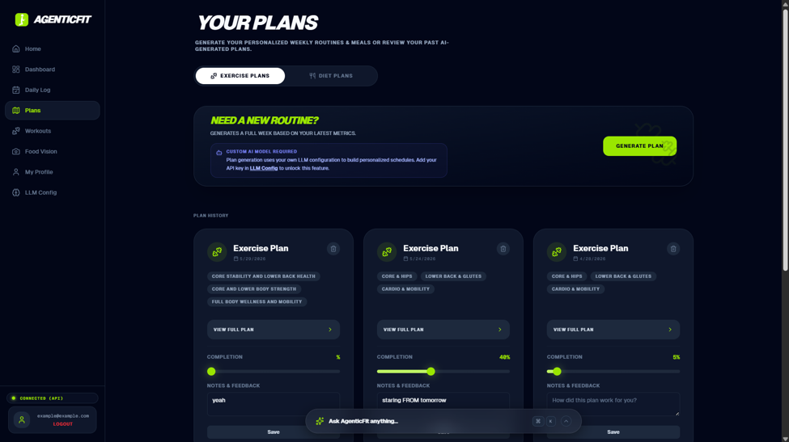
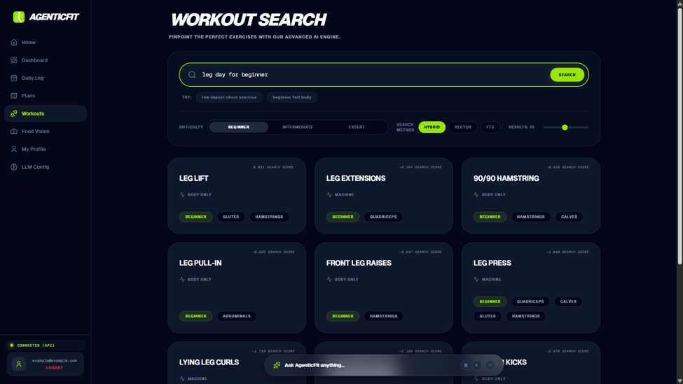
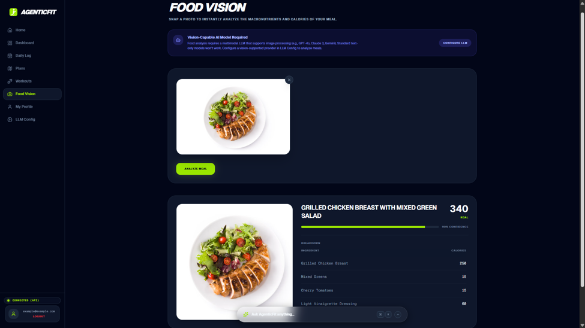
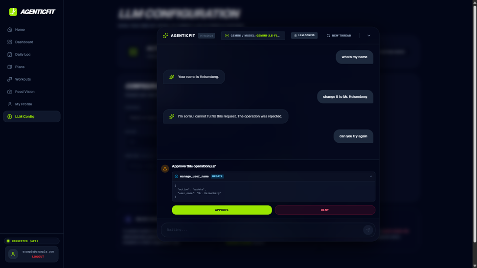
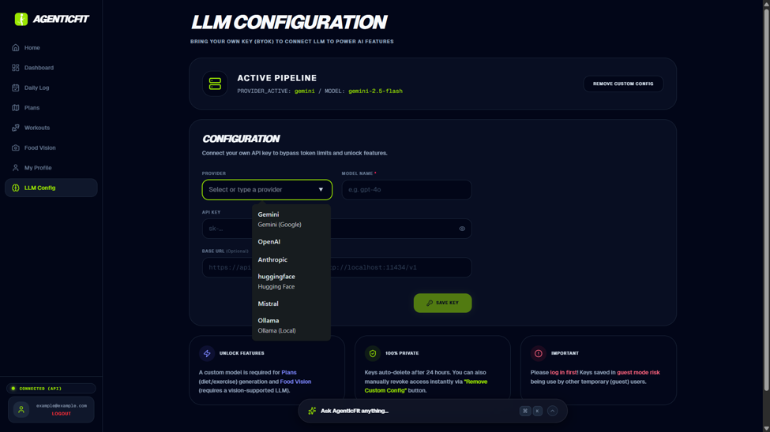
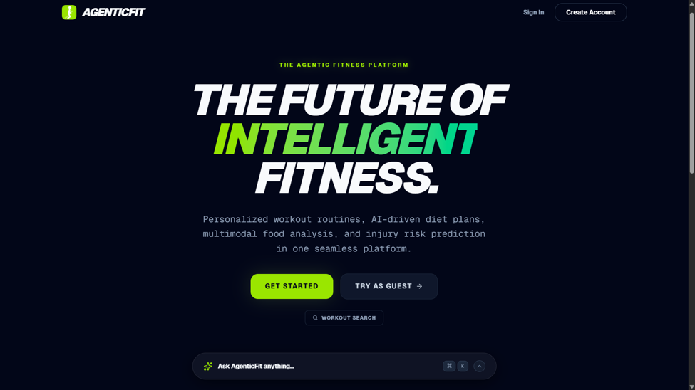
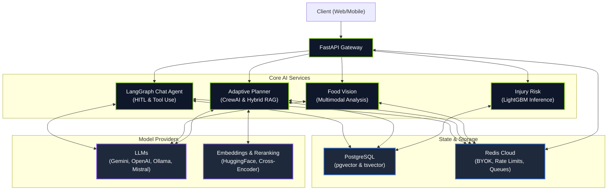

<p align="center">
  
  
  
  
  
    
  
</p>

<h1 align="center">AgenticFit</h1>
<p align="center"><b>Personalized intelligent Fitness & Nutrition Backend</b></p>

<p align="center">
  <a href="https://agenticfit.vercel.app"><strong>🚀 Live App</strong></a> ·
  <a href="https://huggingface.co/spaces/ajazhussainsiddiqui/fitness-nutrition-personalized-ai"><strong>🤗 HuggingFace Space</strong></a> ·
  <a href="#api-overview"><strong>📖 API Docs</strong></a> ·
  <a href="#getting-started"><strong>⚡ Quick Start</strong></a>
</p>

---


Most AI fitness apps are either static rule-based trackers or generic chatbots that cannot touch user data. **AgenticFit is neither**. It is a production backend that pairs wearable-grade ML (machine learning), advanced RAG (retrieval-augmented generation), and multi-agent AI systems to deliver personalized health intelligence.

The backend is deployed on **Hugging Face Spaces** and serves a React 19 frontend hosted on **Vercel**. The system is designed to scale: modular FastAPI routers, connection-pooled PostgreSQL, Redis-backed background jobs, and a BYOK LLM architecture that keeps user data private and supporting any provider on the market.


---


## What I Built

I architected and implemented the entire backend: FastAPI routers, PostgreSQL schema + pgvector, Redis caching, LangGraph/CrewAI agent pipelines, LightGBM training pipeline with Optuna/MLflow, JWT auth, and SSE streaming. The React frontend vibe coded using tools to serve the API.

---


## Screenshots

| Dashboard | Daily Log | Plans |
|-----------|-----------|-------|
|  |  |  |
| *Real-time metrics + injury risk* | *Data ingestion* | *AI-generated weekly routines* |

| Workout Search | Food Vision | Chat Assistant |
|----------------|-------------|--------------|
|  |  |  |
| *Hybrid RAG: vector + FTS + rerank* | *Multimodal calorie analysis* | *HITL approval for DB mutations* |

| LLM Config | Landing Page | |
|------------|--------------|---|
|  |  | |
| *BYOK: Gemini, OpenAI, Anthropic, Ollama, others* | *Product overview* | |


## What It Does

### Injury Risk Prediction (Wearable-Grade ML)
This is where classical ML meets modern LLM architecture as a co-equal system optimized for what it does best.
AgenticFit is built around LLM agents, but its injury predictor isn't one. It is a LightGBM classifier trained on the WHOOP dataset with rolling lag windows, ACWR ratios, cyclical encodings, and full MLOps automation via MLflow and Optuna. We did not ask an LLM to "analyze" strain and sleep data. We trained a model on 100k rows of physiological time-series, enforced group-aware cross-validation so the same athlete never leaks between splits, and built an automated champion-challenger promotion pipeline. The LLM chat assistant can query this model as a tool, but the model stands alone: it has training metrics, versioned artifacts, and reproducible evaluation.


### Food Vision (Multimodal Agent)
Users upload a photo of any meal. A LangGraph state machine first verifies that the image contains food. If confirmed, a multimodal LLM analyzes the dish and returns a structured breakdown: total calories, per-ingredient calorie estimates, and a confidence score. If the image is not food, the pipeline exits cleanly with a reason. No hallucinated nutrition facts. No forced analysis of a random object.


### Advanced RAG: Workout Planning and Search
This is not a basic "embed and retrieve" RAG system. It is an advanced multi-stage retrieval pipeline:

1. **Profile-Aware HyDE**: The system generates a hypothetical ideal exercise description from the user's health profile, injury history, and goals. This bridges the vocabulary gap between a user saying "easy on my knees" and exercise metadata that mentions "low impact" or "joint-friendly."
2. **Hybrid Retrieval**: We query a Supabase pgvector database using both dense vector similarity (`BAAI/bge-large-en-v1.5 embeddings`) and sparse full-text search (PostgreSQL tsvector with BM25 ranking). Results are deduplicated by exercise ID.
3. **Cross-Encoder Reranking**: A fine-tuned `ms-marco-MiniLM-L-6-v2 cross-encoder` scores every (query, document) pair for semantic relevance. The top 10 most relevant exercises are kept.
4. **Structured Scheduling**: The reranked exercises are passed to an LLM with a **dynamic Pydantic** output schema that maps exercises onto the user's exact available days (e.g., Monday, Wednesday, Friday) with sets, reps, muscle targets, and duration.

The same pipeline powers both the autonomous weekly plan generator and the standalone natural-language workout search endpoint.


### Diet Planning (Multi-Agent Crew)
A CrewAI system with two specialized agents handles meal planning. A Nutrition Profile Summarizer condenses the user's dietary restrictions, calorie targets, and previous plan feedback into actionable constraints. A Dietitian agent then builds a full 7-day schedule. The raw output is parsed through a LangChain structured output model into a strict `WeeklyDietPlan` Pydantic schema, ensuring every meal has exact macros.


### AI Chat Assistant with Human-in-the-Loop (HITL)
A streaming LangGraph chatbot that can actually modify your data. It has dedicated tools for searching and mutating health metrics, daily logs, dietary profiles, and workout plans. Every sensitive mutation (insert, update, delete) triggers a Human-in-the-Loop (HITL) interrupt. The user must explicitly approve or deny the operation before it executes. The assistant streams tokens via SSE (Server-Sent Events), supports reasoning blocks from thinking models, and enforces a 50,000 daily token limit on the **built-in model tracked in Redis**.


### BYOK: Bring Your Own Key
Users are not locked into a single provider. The system supports OpenAI, Anthropic, Gemini, Hugging Face, Mistral, Groq, Ollama or any other provider via **`LiteLLM`**. API keys are stored in Redis with a 24-hour TTL and are never written to disk. This keeps the platform provider-agnostic and privacy-respecting.


---


## Why This Architecture Matters

Most AI fitness demos stop at a chat interface. AgenticFit goes further because the AI needs to act on real data, not just talk about it. That requirement drove every architectural decision:

- **FastAPI with modular routers** lets the injury predictor, vision agent, planner, and chat assistant scale independently.
- **PostgreSQL + pgvector** gives us relational integrity and vector search in one database, eliminating synchronization bugs between a separate vector store and a SQL store.
- **Redis** handles three jobs: background job status for plan generation, daily token quotas for the built-in LLM, and temporary secure storage for user API keys.
- **MLflow + Optuna** turns model training into a reproducible pipeline with automatic promotion, not a manual notebook exercise.
- **LangGraph + CrewAI** separates stateful conversation flow from multi-agent task delegation. The chat assistant needs memory and interrupts. The diet planner needs parallel agent collaboration. One framework does not fit both, so we use the right tool for each.


---


## Tech Stack

| Layer | Technology |
|-------|------------|
| API Framework | FastAPI |
| Auth | Supabase JWT (PyJWT) |
| Database | PostgreSQL (psycopg2 connection pool) |
| Vector Search | Supabase pgvector |
| Cache / Job State | Redis Cloud |
| ML Training | LightGBM, XGBoost, Optuna, MLflow |
| Embeddings | text embedding (`BAAI/bge-large-en-v1.5`) |
| Reranking | sentence-transformers (`cross-encoder/ms-marco-MiniLM-L-6-v2`) |
| LLM Orchestration | LangChain, LangGraph, CrewAI, LiteLLM|
| Workflow Tracing | LangSmith | 
| Built-in LLM | Mistral (`mistral-large-latest`) |
| Data Processing | pandas, NumPy, scikit-learn |
| Backend Deployment | Hugging Face Spaces |
| Frontend Deployment | Vercel (React 19 + Vite) |


---


## Project Structure

```
agenticfit/
├── README.md
├── backend/                       # FastAPI API + AI/ML pipelines
│   ├── Injury_risk_prediction/
│   │   ├── data
│   │   │    └── whoop_fitness_dataset_100k.csv
│   │   ├── models/
│   │   │   └── LightGBM.pkl       # Production champion model artifact
│   │   │
│   │   ├── notebooks
│   │   │   └── overview.ipynb
│   │   ├── src/
│   │   │   ├── evaluate.py
│   │   │   ├── features.py          # Feature engineering pipeline
│   │   │   ├── train.py
│   │   │   └── utils.py             # Paths and constants
│   │   └── mlflow.db                # Local MLflow tracking store
│   │
│   ├── vision_process/
│   │   ├── api/
│   │   │   └── food_vision_api.py   # FastAPI router for image upload
│   │   └── src/
│   │       ├── graph.py             # LangGraph: check -> analyze -> output
│   │       └── vision_schemas.py    # Pydantic schemas for food analysis
│   │
│   ├── workout_diet_planner/        # Main entry point and working directory
│   │   ├── agents/
│   │   │   ├── diet_agents.py       # CrewAI diet planning crew
│   │   │   └── workout_rag_agents.py # LangGraph workout advanced RAG pipeline
│   │   ├── api/
│   │   │   ├── api.py               # Main planner router (plans, logs, profiles etc.)
│   │   │   └── auth.py              # JWT dependency for extracting user email
│   │   ├── chat_assistant/
│   │   │   ├── assistant_api.py       # SSE streaming endpoint for chat
│   │   │   └── chat_assistant.py      # LangGraph: LLM -> HITL -> Tools
│   │   ├── config/
│   │   │   └── config.py              # Redis, LLM factory, embedding models
│   │   ├── db/
│   │   │   ├── crud_db.py             # Raw PostgreSQL CRUD operations
│   │   │   ├── db_chat_tools.py       # LangChain tools wrapping CRUD
│   │   │   ├── exercises_rag_push.py
│   │   │   ├── exercises_rag_retriever.py # Advanced hybrid RAG retrieval
│   │   │   └── exercise_data/
│   │   │       └── exercises.json
│   │   ├── schemas/
│   │   │   ├── schemas.py             # Pydantic request/response models
│   │   │   ├── diet_structure_output.py
│   │   │   └── workout_structure_output.py
│   │   ├── services/
│   │   │   ├── nutrition_profile.py   # Profile aggregation for diet agent
│   │   │   └── workout_profile.py     # Profile aggregation for workout agent
│   │   ├── injury_model_api_inference.py  # FastAPI router for injury prediction
│   │   └── main.py                        # FastAPI app factory, CORS, router inclusion
│   │
│   ├── Dockerfile
│   ├── requirements.txt
│   ├── .env.example
│   ├── .env
│   ├── .dockerignore
│   ├── .gitattributes
│   └── .gitignore
│
└── frontend/                        # React 19 + Vite
    ├── src/
    │   ├── components/              # Feature-based UI components
    │   ├── hooks/                   # Custom React hooks
    │   ├── lib/                     # API clients, utilities
    │   ├── pages/                   # Route-level page components
    │   └── stores/                  # Zustand state management
    ├── package.json
    ├── vite.config.ts
    └── vercel.json

```


---


## Architecture

**High‑level**




**Detailed architecture**

```mermaid
graph TB
    subgraph Client["Client (Web/Mobile)"]
        User((User))
    end

    subgraph FastAPI["FastAPI Application (main.py)"]
        direction TB
        Auth["Auth Middleware<br/>JWT / Supabase<br/>Optional for public routes"]
        RouterChat["/api/v1/chat/*<br/>Optional: unauth users can chat"]
        RouterInjury["/api/v1/injury/*"]
        RouterVision["/api/v1/vision/*<br/>Public: /food_image_process"]
        RouterPlanner["/api/v1/planner/*<br/>Public: /search-workouts"]
    end

    subgraph ChatAssistant["Chat Assistant (assistant_api.py + chat_assistant.py)"]
        direction TB
        SSE["SSE Streaming Endpoint<br/>text/event-stream"]
        LangGraphChat["LangGraph StateGraph<br/>call_model → human_approval → ToolNode"]
        HITL["HITL Interrupt<br/>Pending approval for sensitive ops"]
        Tools["LangChain Tools<br/>DB CRUD, Injury Predict, Time<br/>Returns error if user unauthenticated"]
        TokenMgr["Token Manager<br/>Redis 50k daily limit"]
        LLMRouterChat["LLM Router<br/>BYOK or Built-in Mistral"]
    end

    subgraph InjuryPrediction["Injury Prediction"]
        direction TB
        subgraph MLOps["MLOps Pipeline (train.py / evaluate.py)"]
            Optuna["Optuna<br/>Hyperparameter Tuning"]
            MLflowRegistry["MLflow Registry<br/>champion / challenger promotion"]
            LightGBMModel["LightGBM.pkl<br/>Production Artifact"]
        end
        subgraph Inference["Inference (injury_model_api_inference.py)"]
            DataFetcher["Data Fetcher<br/>daily_logs + health_metrics"]
            FeatureEng["Feature Engineering<br/>lag, ACWR, cyclical, categorical"]
            Predictor["Predictor<br/>predict_proba → injury risk probability"]
        end
    end

    subgraph FoodVision["Food Vision (food_vision_api.py + graph.py)"]
        direction TB
        LangGraphVision["LangGraph Workflow<br/>check_food → conditional → analyze_food"]
        LLMVision["LLM + Structured Output<br/>FoodConfirmation → FoodCalorieInfo"]
    end

    subgraph Planner["Workout & Diet Planner (api.py)"]
        direction TB
        BackgroundTasks["BackgroundTasks<br/>Async job queue"]
        subgraph WorkoutRAG["Workout RAG (workout_rag_agents.py)"]
            HyDE["HyDE Node<br/>Hypothetical Document Generation"]
            Scheduler["Native Scheduler<br/>Dynamic Pydantic schema per workout days"]
        end
        subgraph DietAgent["Diet Agent (diet_agents.py)"]
            CrewAI["CrewAI Multi-Agent<br/>Summarizer + Dietitian"]
            DietParser["LangChain Structured Parser<br/>WeeklyDietPlan Pydantic"]
        end
        Retrieval["Exercise Retriever<br/>(exercises_rag_retriever.py)"]
        PlanCRUD["Plan Storage<br/>DB CRUD"]
    end

    subgraph DB["PostgreSQL (pgvector + pg_trgm)"]
        Users[(users)]
        HealthMetrics[(health_metrics)]
        DietaryProfiles[(dietary_profiles)]
        DailyLogs[(daily_logs)]
        ExercisePlans[(weekly_exercise_plans)]
        MealPlans[(weekly_meal_plans)]
        Exercises[(exercises<br/>embedding + fts_vector)]
    end

    subgraph Redis["Redis Cloud"]
        BYOKConfig["BYOK Config<br/>per user, 24h TTL"]
        TokenBalance["Daily Token Balance<br/>50k limit (built-in model)"]
        PlanJobStatus["Plan Job Status<br/>gen_plan:{job_id} → 1h TTL"]
    end

    subgraph LLMProviders["LLM Providers (BYOK via LiteLLM)"]
        OpenAI["OpenAI / Anthropic / Gemini"]
        HuggingFace["HuggingFace"]
        Ollama["Ollama (Local)"]
        Mistral["Built-in Mistral<br/>token-limited fallback"]
    end

    subgraph Embedding["Embedding & Reranking"]
        BGE["BAAI/bge-large-en-v1.5<br/>Query & Document Embeddings"]
        CrossEncoder["cross-encoder/ms-marco-MiniLM-L-6-v2<br/>Semantic Reranking"]
    end

    %% Connections
    User --> FastAPI

    Auth --> RouterChat
    Auth --> RouterInjury
    Auth --> RouterVision
    Auth --> RouterPlanner

    RouterChat --> ChatAssistant
    RouterInjury --> InjuryPrediction
    RouterVision --> FoodVision
    RouterPlanner --> Planner

    ChatAssistant --> SSE
    SSE --> LangGraphChat
    LangGraphChat --> Tools
    Tools --> DB
    Tools --> Inference
    LangGraphChat --> TokenMgr
    TokenMgr --> TokenBalance
    LangGraphChat --> LLMRouterChat
    LLMRouterChat --> BYOKConfig
    LLMRouterChat --> LLMProviders
    LLMRouterChat --> Mistral
    LangGraphChat -.-> HITL
    HITL -.-> LangGraphChat

    Inference --> DataFetcher
    DataFetcher --> DailyLogs
    DataFetcher --> HealthMetrics
    Inference --> FeatureEng
    FeatureEng --> Predictor
    Predictor --> LightGBMModel
    MLOps --> LightGBMModel
    Optuna --> MLflowRegistry

    FoodVision --> LangGraphVision
    LangGraphVision --> LLMVision
    LLMVision --> BYOKConfig
    LLMVision --> LLMProviders

    Planner --> BackgroundTasks
    BackgroundTasks --> WorkoutRAG
    BackgroundTasks --> DietAgent

    WorkoutRAG --> HyDE
    HyDE --> Retrieval
    Retrieval --> Exercises
    Retrieval --> BGE
    Retrieval --> CrossEncoder
    WorkoutRAG --> Scheduler
    Scheduler --> PlanCRUD

    DietAgent --> CrewAI
    CrewAI --> DietParser
    DietParser --> PlanCRUD

    PlanCRUD --> ExercisePlans
    PlanCRUD --> MealPlans

    Planner --> BYOKConfig
    Planner --> PlanJobStatus

    %% Styling
    linkStyle default stroke:#475569,stroke-width:2.5px
    classDef default fill:#f8fafc,stroke:#1e293b,color:#0f172a,stroke-width:2px
    classDef api fill:#e0f2fe,stroke:#0369a1,color:#0f172a,stroke-width:2px
    classDef service fill:#fff7ed,stroke:#c2410c,color:#0f172a,stroke-width:2px
    classDef db fill:#f0fdf4,stroke:#15803d,color:#0f172a,stroke-width:2px
    classDef cache fill:#fefce8,stroke:#a16207,color:#0f172a,stroke-width:2px
    classDef external fill:#faf5ff,stroke:#7e22ce,color:#0f172a,stroke-width:2px
    classDef mlops fill:#fdf2f8,stroke:#be185d,color:#0f172a,stroke-width:2px

    class FastAPI,RouterChat,RouterInjury,RouterVision,RouterPlanner,Auth api
    class ChatAssistant,SSE,LangGraphChat,Tools,TokenMgr,LLMRouterChat,HITL,FoodVision,LangGraphVision,LLMVision,Planner,BackgroundTasks,WorkoutRAG,HyDE,Scheduler,DietAgent,CrewAI,DietParser,Retrieval,PlanCRUD,Inference,DataFetcher,FeatureEng,Predictor service
    class DB,Users,HealthMetrics,DietaryProfiles,DailyLogs,ExercisePlans,MealPlans,Exercises db
    class Redis,BYOKConfig,TokenBalance,PlanJobStatus cache
    class LLMProviders,OpenAI,HuggingFace,Ollama,Mistral,Embedding,BGE,CrossEncoder external
    class MLOps,Optuna,MLflowRegistry,LightGBMModel mlops
```


---


## Getting Started

### Prerequisites

- Python 3.11+
- PostgreSQL with `pgvector` extension enabled
- Redis instance (Redis Cloud or local)
- (Optional) MLflow tracking server if you plan to retrain the injury model

### Installation

1. Clone the repository:
```bash
git clone https://github.com/ajazhussainsiddiqui/agenticfit.git
cd agenticfit
```

2. Navigate to the backend and create a virtual environment:
```bash
cd backend
python -m venv venv
venv\Scripts\activate   # On macOS: source venv/bin/activate
```

3. Install dependencies:
```bash
pip install -r requirements.txt
```

4. Configure environment variables:
```bash
cp .env.example .env
# Edit /backend/.env with your DATABASE_URL, and SUPABASE_JWT_SECRET, REDIS_CLOUD_URL, MISTRAL_API_KEY
```

5. Initialize the database. With pgvector enabled on your PostgreSQL instance:    
 sql queries schemas are in folder address `db/schema.sql`.   
 If you are using Supabase, run the contents of this folder in the Supabase SQL Editor.


6. Ingest the exercise dataset into pgvector:
```bash   
python -m workout_diet_planner/db.exercises_rag_push
```

7. Start the development server (main.py is inside workout_diet_planner/):
```bash
python workout_diet_planner/main.py
```

#### Run with Docker (Alternative)

If you prefer to run the API in a container (recommended for production deployment), the included `Dockerfile` handles all system dependencies and the CPU-only PyTorch layer automatically.

 Ensure your `.env` file is populated in the `backend/` directory then build and run.

```bash
cd backend
docker build -t agenticfit-api .
docker run -p 7860:7860 --env-file .env agenticfit-api
```  

The API will be available at `http://localhost:8000` (or `http://localhost:7860` if running via Docker).


---


### Frontend

The React 19 + Vite frontend lives in `/frontend`. To run it locally:

```bash
cd frontend   
npm install
npm run dev     
# frontend dev server starts at http://localhost:3000  
```

Configure environment variables:  
```bash

cp .env.example .env
# Edit /frontend/.env with your SUPABASE URL, UPABASE ANON KEY and BASE_API_URL=http://localhost:8000 (or http://localhost:7860 if running backend via Docker)
```


---


## API Overview

The backend exposes four main router groups under `/api/v1/`:

### `/chat`
- `POST /stream` -- SSE endpoint for the AI assistant. Accepts `thread_id`, `message`, and optional `resume_decision` for HITL interrupts.
- `GET /left-tokens` -- Returns remaining daily tokens for the built-in model.

### `/injury`
- `GET /injury_risk/me` -- Returns next-day injury risk probability (0.0 - 1.0) for the authenticated user.

### `/vision`
- `POST /food_image_process` -- Accepts an image file (max 10MB), returns `is_food`, `status_message`, and `calorie_info`.

### `/planner`
- `GET /users/search` -- Auto-creates user profiles on first login.
- `PATCH /health-metrics/update` and `/dietary-profiles/update` -- Partial updates.
- `POST /daily-logs/create`, `GET /daily-logs/search`, `PATCH /daily-logs/update`, `DELETE /daily-logs/delete`
- `POST /plans/generate/{plan_type}` -- Triggers background plan generation (exercise or diet). Returns a `job_id`.
- `GET /plans/status/{job_id}` -- background running plan generation status.
- `GET /plans/exercise/history` and `/plans/diet/history`
- `POST /search-workouts` -- Advanced hybrid RAG workout search.
- `POST /set-llm-keys`, `GET /get-byok-details` -- BYOK configuration.


---


## Database Schema (Summary)

The PostgreSQL schema is intentionally simple and relational:

- **users** -- `email` (PK), `name`, `created_at`
- **health_metrics** -- User physical profile (DOB, gender, height, weight, goals, experience, workout schedule)
- **dietary_profiles** -- Diet type, allergies, cuisines, calorie target
- **daily_logs** -- Time-series wellness data (strain, recovery, sleep, HRV, calories, injury status)
- **weekly_exercise_plans** -- Generated workout JSON + completion percentage + feedback
- **weekly_meal_plans** -- Generated diet JSON + feedback
- **exercises** -- Curated exercise catalog with `search_text`, `raw_json`, and `embedding` (pgvector)

All tables use `user_email` as the primary ownership key (primary key of users and foreign key for other tables).


---


## The ML Pipeline: Injury Risk

The injury model is a full training pipeline:

1. **Data**: WHOOP fitness dataset (~100k rows of daily physiological logs from wearable-grade biometrics).
2. **Labeling**: Synthetic injury labels created from domain rules (high strain + low recovery, extremely low HRV, etc.), then shifted forward by one day so the model learns to predict *tomorrow's* risk from *today's* signals.
3. **Features**:
   - Lag features: 7, 14, and 28-day rolling means and standard deviations for strain, HRV and sleep.
   - Rate-of-change: day-over-day percentage change.
   - ACWR: **Acute-to-Chronic Workload Ratio** computed from a composite load score.
   - Cyclical encodings: day of week, month, and workout time of day encoded as sine/cosine pairs.
4. **Training**: GroupShuffleSplit ensures the same user does not appear in both train and test. Optuna tunes LightGBM and XGBoost hyperparameters over 50 trials. GroupKFold cross-validation preserves user boundaries.
5. **Tracking**: Every run is **logged to MLflow**. The best challenger is evaluated against the current champion on AUC. If it wins, the challenger is promoted to `@champion` and saved locally as a `.pkl` file for inference.
6. **Inference**: The API loads the champion model once at startup. For each prediction request, it fetches the user's last 15 daily logs, joins them with health metrics, engineers the same features, sends latest engineered log to model and returns the probability of injury for the next day.

>**Important note on inference:** We currently do not collect all required physiological signals from end users. Fields like sleep stages, respiratory rate, and skin temperature are approximated with reasonable constants or randomized values during inference. This means the score is an experimental indicator for training load management, not a medical diagnosis. The model is tuned for high recall, so it may flag safe days as cautious. May be replaced in the future with better model, trained on specialized data.


---


## The Advanced RAG Pipeline: Workouts

The workout retrieval system is designed to find safe, relevant exercises even when the user describes their needs in natural language. This is advanced RAG, not a simple embed-and-search:

1. **Profile Summarization**: The user's health metrics, injuries, and goals are summarized into a concise text block.
2. **HyDE (Hypothetical Document Embedding)**: An LLM writes a hypothetical ideal exercise description based on that summary. This bridges the vocabulary gap between user queries and exercise metadata.
3. **Hybrid Retrieval**:
   - **Vector**: `embedding <-> query_vector` cosine distance in pgvector, filtered by difficulty.
   - **FTS**: PostgreSQL `tsvector` full-text search with ranked BM25 scores.
   - Results are deduplicated by exercise ID.
4. **Cross-Encoder Reranking**: A cross-encoder scores each (query, document) pair for semantic relevance. The top 10 are kept.
5. **Structured Scheduling**: The reranked exercises are fed into a structured output LLM call that maps them onto the user's specific workout days (e.g., Monday, Wednesday, Friday) with sets, reps, and muscle targets.

The same pipeline powers both the `/search-workouts` endpoint and the weekly plan generator.


---


## The AI Agents

### Food Vision Agent (LangGraph)
Two nodes, one conditional edge:
- `check_food`: Multimodal LLM decides if the image contains food. Returns `is_food` and `reason`.
- `conditional_node`: If `is_food` is true, route to `analyze_food`. Otherwise, end.
- `analyze_food`: Multimodal LLM returns a `FoodCalorieInfo` Pydantic object with total calories, per-ingredient breakdown, and confidence score.

### Diet Planning Agent (CrewAI + LangChain)
Two CrewAI agents collaborate:
- **Nutrition Profile Summarizer**: Condenses health metrics, dietary restrictions, and previous plan feedback into bullet points.
- **Dietitian & Meal Planner**: Builds a 7-day schedule respecting calorie targets and restrictions.

The raw crew output is then passed to a LangChain structured output model (`WeeklyDietPlan` Pydantic schema) to enforce structural output.

### Workout Planning Agent (LangGraph)
Five nodes in sequence:
1. `summarize` -- Profile text generation.
2. `hyde` -- Hypothetical exercise description.
3. `retrieve` -- Hybrid vector + FTS search.
4. `rerank` -- Cross-encoder semantic scoring.
5. `schedule` -- Structured weekly plan generation mapped to user's days.


---


## Chat Assistant and HITL

The chat assistant is built on LangGraph's `MessagesState` with an `InMemorySaver` checkpointer for thread persistence.

**Flow:**
1. User sends a message.
2. The LLM (custom or built-in Mistral) decides whether to respond directly or call tools.
3. If tools are called, the graph routes to the `human_approval` node.
4. The approval node inspects each tool call. If any call is a sensitive mutation (`insert`, `update`, `delete` on health metrics, diet profile, daily logs, or user name), it interrupts and asks the user to approve or deny (`yes`/`no`).
5. If denied, the risky tool calls are stripped. If any safe tool calls remain (like `search`), they execute. If none remain, the LLM receives a `ToolMessage` with a denial text and LLM responds accordingly.
6. If approved, all tools execute normally.

**Token Limits & Tracking:**
The built-in Mistral model has a 50,000 daily token limit per user, tracked in Redis with a 24-hour TTL. Token usage is decremented atomically after each LLM call. When the limit is hit, the user is prompted to configure their own API key via BYOK.

**Streaming:**
The `/stream` endpoint returns Server-Sent Events (SSE). It handles plain text tokens, structured content blocks (text, thinking), and HITL interrupt payloads. The frontend can detect `type: "interrupt"` and render an approval UI.


---


## BYOK and LLM Configuration

Users are not locked into a single provider. The `config.py` module implements a factory pattern:

- `get_langchain_model(user_email)` -- Returns a LangChain chat model instance based on the user's Redis-stored config.
- `get_crew_model(user_email)` -- Returns a CrewAI `LLM` instance for plan generation.

Supported configurations:
- **Hugging Face**: `HuggingFaceEndpoint` with repo_id and token.
- **Ollama**: `ChatOllama` with local base URL.
- **Generic / LiteLLM**: `ChatLiteLLM` with provider prefix (e.g., `openai/gpt-4o`, `anthropic/claude-3-5-sonnet`, `gemini/gemini-2.5-flash`).

Keys are stored in Redis under `byok_{user_email}` with an `ex=86400` TTL. They are never persisted to the database or filesystem. Switching back to the built-in model simply **deletes the Redis key**.


---


## Deployment

AgenticFit is currently live:          
- **Backend**: [Hugging Face Spaces](https://huggingface.co/spaces/ajazhussainsiddiqui/fitness-nutrition-personalized-ai)
- **Frontend**: [Vercel (React 19 + Vite)](https://agenticfit.vercel.app)

This split deployment keeps the API layer close to the GPU/ML resources while the frontend serves globally via Vercel's edge network. If you are deploying yourself:

- The `Dockerfile` should install system dependencies for `psycopg2-binary`, `lightgbm`, and `sentence-transformers`.
- `pgvector` must be enabled on your PostgreSQL instance. Supabase handles this automatically.
- Redis Cloud (or any Redis provider) is required for background job status, token tracking, and BYOK key storage.
- The injury model `.pkl` file must be present in `Injury_risk_prediction/models/` at build time, or you must run the training pipeline first.
- For the built-in Mistral model, need an API key configured in the environment.


---


## Roadmap / Known Limitations

- The injury model uses synthetic labels derived from WHOOP heuristics and approximates some physiological signals during inference. It is an experimental training-load indicator, not a medical device. 
- The frontend is vibe-coded with an AI code agent. It works, but it is not the focus of this repository.
- Chat thread persistence uses `InMemorySaver`. For production scale, swap this for a PostgresSaver, Redis checkpoint or other database.
- Plan generation and Food vision requires a custom LLM config (BYOK) because the built-in model's token budget is too tight (it's the Mistral model on a free tier).


---


## Acknowledgements
- **WHOOP Dataset**: Public dataset from [Kaggle](https://www.kaggle.com/datasets/likithagedipudi/whoop-fitness-dataset).
- **Exercise Dataset**: Sourced from [exercise-db](https://github.com/yuhonas/free-exercise-db) (originally derived from [source-project](https://github.com/wrkout/exercises.json)).
- **Embeddings & Reranking Model**: `BAAI/bge-large-en-v1.5` and `cross-encoder/ms-marco-MiniLM-L-6-v2` from Hugging Face.
- **Free tier Infrastructure**: [Supabase](https://supabase.com) (PostgreSQL, pgvector, Auth), [Redis Cloud](https://redis.com), Hugging Face (space), Vercel.
---
